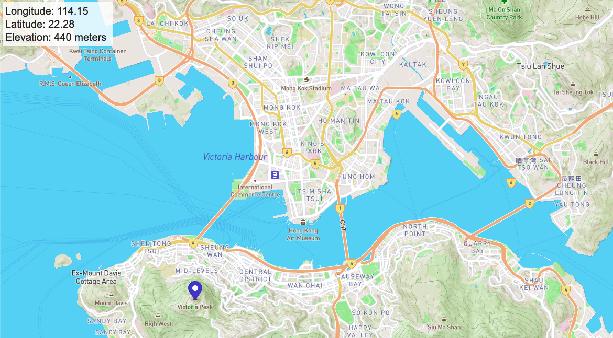

# Elevation

### Description
Finding elevations can be more difficult than it needs to be. This project allows a user to click on a location and view its longitude, latitude, and elevation from a map produced inside the browser. The elevation measurements are accurate to 10 meters. Since Hong Kong is a unique city with varying elevations, so your map will start there, but you can feel free to move anywhere you like!

### Notes
The webpage was completed as part of the Mapbox "Find elevations with the Tilequery API," which you can find [here](https://docs.mapbox.com/help/tutorials/find-elevations-with-tilequery-api/).

